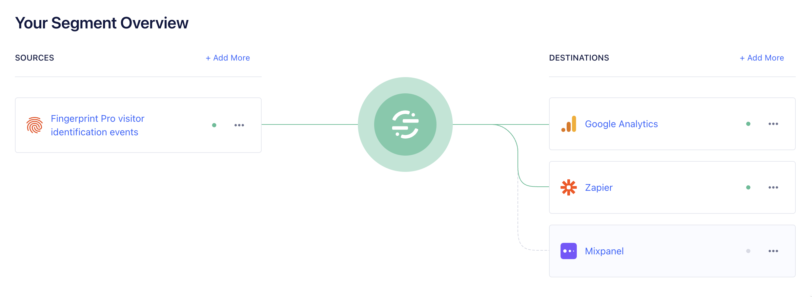

<p align="center">
  <a href="https://fingerprint.com">
    <picture>
     <source media="(prefers-color-scheme: dark)" srcset="https://fingerprintjs.github.io/home/resources/logo_light.svg" />
     <source media="(prefers-color-scheme: light)" srcset="https://fingerprintjs.github.io/home/resources/logo_dark.svg" />
     
   </picture>
  </a>
</p>
<p align="center">
  <a href="https://github.com/fingerprintjs/fingerprint-pro-segment-source-function/actions/workflows/build.yml">
    
  </a>
  <a href="https://fingerprintjs.github.io/fingerprint-pro-segment-source-function/coverage">
    
  </a>
  <a href="https://github.com/fingerprintjs/fingerprint-pro-segment-source-function/actions/workflows/release.yml">
    
  </a>
  <a href="https://opensource.org/licenses/MIT">
    
  </a>
  <a href="https://discord.gg/39EpE2neBg">
    
  </a>
   <a href="https://fingerprintjs.github.io/fingerprint-pro-segment-source-function/docs/">
     
   </a>
</p>

# Fingerprint Pro Segment Source Function

This Segment [Source function](https://Segment.com/docs/connections/functions/source-functions/) allows you to use [Fingerprint Pro](https://fingerprint.com/) visitor identification data as a data source in Segment. The function receives the data through Fingerprint [webhooks](https://dev.fingerprint.com/docs/webhooks) and normalizes them into Segment [Specs](https://segment.com/docs/connections/spec/). Once your Fingerprint data is inside Segment, you can use it in any of your Segment destinations to detect suspicious activity, prevent fraud or personalize user experiences.

 

## ⚠️ Requirements and limitations

Please note that this library runs by Segment's custom JavaScript runtime. To test and build locally, this library requires these:

- Node 18+
- Typescript 4
- Playwright (with a headless browser preferably chromium)

To use this library:

* You need to have the Fingerprint Pro [JavaScript agent](https://dev.fingerprint.com/docs/js-agent) installed on your website and configured to send data to Segment. Installing Segment on your website directly is not required. 
* Mobile platforms are currently not supported. Reach out to our [support](https://fingerprint.com/support) if you have any questions.

## How to set up

### 1. Import the Fingerprint Segment Source Function

1. Log in to your Segment account.
2. Navigate to **Connections** > **Catalog** and switch to the **Functions** tab.
3. Click **New Function**.
4. Select **Source**, then click **Build**.
5. Replace the source code with the [latest Fingerprint Segment source function](https://github.com/fingerprintjs/fingerprint-pro-segment-source-function/releases/latest/download/fingerprint-pro-segment-source-function.js).
6. Click **Configure**, and enter a descriptive name, such as `Fingerprint Pro Source Function`.
7. Optionally, you can add a description and logo of your choice.
8. Click **Create Function**.

You have successfully created a Segment Source Function.

### 2. Create a Segment Source connected to the Fingerprint Source function

Continuing from the previous step (or if you have closed the browser tab, go to **Connections** > **Catalog** > **Functions** > **Fingerprint Pro Source Function**)

1. Click **Connect Source**.
2. Add a descriptive name, for example `Fingerprint Pro visitor identification events`. Optionally, you can put labels of your choice.
3. Click **Continue**, then **Continue** again, a finally **Finish**.

You have successfully created a Segment Source. The source overview page will show you the webhook URL. Keep it handy, you will need it in the next step.

### 3. Configure a Fingerprint webhook to send data to Segment

1. Log in to your Fingerprint account.
2. Go to **App Settings** > **Webhooks**.
3. Click **Add Webhook**.
4. Paste the webhook URL of your Source. (You can always find it in **Segment** > **Connections** > **Sources** > **Your Fingerprint Source** > **Overview** )
5. Optionally, add a description, for example "Segment source". Do not set any authentication.
6. Click **Save**.
7. Click **Send Test Event** and wait for a confirmation that Segment successfully received the test event data. If you do not see the confirmation, check the webhook URL and try again. Sending the test event can take a minute or two.

You have successfully configured a Fingerprint webhook. For every visitor identification event, Fingerprint will now send the identification result to your Segment Source Function.

### 4. Configure the Fingerprint Pro JavaScript Agent on your website

The Segment integration is _not_ enabled by default. Your website must have the Fingerprint JS Agent installed and configured explicitly to use the Segment Integration.

1. If you haven't already, [install the Fingerprint JS Agent](https://dev.fingerprint.com/docs/js-agent) on your website, for example: 

  ```html
  <script>
    // Load the JavaScript agent
    const fpPromise = import('https://fpjscdn.net/v3/your-public-api-key')
      .then(FingerprintJS => FingerprintJS.load({ endpoint: 'https://metrics.your-website.com'}))

    // Analyze the visitor when necessary.
    fpPromise
      .then(fp => fp.get())
      .then(result => console.log(result.visitorId))
  </script>
  ```
2. Insert a `tag.integrations.segment` object into the options of the JS agent's `get` method to enable your Segment integration. The Segment Source function will ignore identification events received from Fingerprint that do not include the `tag.integrations.segment` object. For more info about `tag` see the [JS agent API Reference](https://dev.fingerprint.com/docs/js-agent#tag).

```javascript
  fpPromise.then(fp =>
    fp.get({
      tag: {
        integrations: {
          segment: {
            /* segment fields */
          },
        },
      },
    })
  );
  ```

3. Inside the `segment` object, define [Segment Specs](https://segment.com/docs/connections/spec/), like below:

  ```javascript
  const segmentFields = {
    skipIntegration: false,
    identify: {
      // ... identify spec fields
    },
    page: {
      // ... page spec fields
    },
    track: {
      // ... track spec fields
    },
    group: {
      // ... group spec fields
    }
  }
  ```
  You can use `identify`, `page`, `group`, and `track` for corresponding Specs. You can use any or all specs in a single request, the Identify Spec is sent even when omitted. You can use `skipIntegration` for skipping the segment integration entirely.

  See [How to use](#how-to-use) for more details on each spec.

### Receiving and using the data

Now that the JS Agent and Segment Source are connected, the Specs should be flowing to your segment account as visitors come your website and are identified by Fingerprint Pro. 

You can debug the data coming in by going to **Connections** > **Sources** > **Your Fingerprint Source** > **Debugger**.
Set up some [destinations](https://segment.com/docs/connections/destinations/catalog/#security-fraud) to use the data, for example, Google Analytics, Castle, Mixpanel, or others that suit your business needs the best.

## How to use

The Fingerprint Pro Segment Source function creates Specs based on the the [visitor identification result](https://dev.fingerprint.com/docs/js-agent#get-response) and the metadata you pass to the `tag.integration.segment` object. 


<details>
<summary>Full Example</summary>

```javascript
fp.get({
  tag: {
    integrations: {
      segment: {
        skipIntegration: false,
        identify: {
          userId: 'your_internal_ID_123456',
          traits: {
            name: 'Jon Doe',
          },
        },
        page: {
          category: 'Account',
          name: 'Update Password',
          properties: {
            path: '/account/password',
            referrer: '/account/home',
          },
          context: {
            trial: true,
          }
        },
        track: {
          event: 'Plan Updated',
          properties: {
            currency: 'USD',
            value: '19.99'
          }
        },
        group: {
          groupId: '0e8c78ea9d97a7b8185e8632',
          traits: {
            name: 'Fingerprint',
            industry: 'Tech',
            employees: 110,
          },
        },
      }
    }
  }
  // ... more fields
})
```
</details>

### Identify Spec

The [Identify Spec](https://segment.com/docs/connections/spec/identify/) lets you record who the visitor is and the traits you know about them. You can use the `segment.identify` field to pass your visitor metadata to Segment. This spec is always created based on the visitor identification result, even when you omit the `identify` field.

```javascript
const segment = {
  identify: {
    userId: '123456',
    traits: {
      name: 'Jon Doe',
    },
  },
}
```
  
This is how fields in the Identify Spec are populated:

| Identify Spec field | Source field in Fingerprint Pro `result` or metadata passed to `segment.identify`                                  |
| ------------------- | ------------------------------------------------------------------------------------------------------------------ |
| `anonymousId`       | [`result.visitorId`](https://dev.fingerprint.com/docs/js-agent#visitorid) - Fingerprint `visitorId`                |
| `traits.visitorId`  | [`result.visitorId`](https://dev.fingerprint.com/docs/js-agent#visitorid) - Fingerprint `visitorId`                |
| `traits.createdAt`  | [`result.firstSeenAt.subscription`](https://dev.fingerprint.com/docs/js-agent#firstseenat) - time of first visit   |
| `userId`            | `identify.userId` - your internal user ID                                                                          |
| `traits`            | `identify.traits` - any traits you want to record                                                                  |


### Page Spec

The [Page Spec](https://segment.com/docs/connections/spec/page/) lets you record whenever a user sees a page of your website, along with any optional properties about the page. It is defined by the `page` field.

```javascript
const segment = {
  page: {
    category: 'Account',
    name: 'Update Password',
    properties: {
      path: '/account/password',
      referrer: '/account/home',
    },
    context: {
      trial: true,
    }
  },
}
```

This is how fields in the Page Spec are populated:

| Page Spec field           | Source field in Fingerprint Pro `result` or metadata passed to `segment`                                                                 |
| ------------------------- | ---------------------------------------------------------------------------------------------------------------------------------------- |
| `anonymousId`             | [`result.visitorId`](https://dev.fingerprint.com/docs/js-agent#visitorid) - Fingerprint `visitorId`                                      |
| `userId`                  | `identify.userId` - your internal user ID                                                                                                |
| `context.ip`              | [`result.ip`](https://dev.fingerprint.com/docs/js-agent#ip) - IP address                                                                 |
| `context.browserDetails`  | [`result.browserDetails`](https://dev.fingerprint.com/docs/webhooks#identification-webhook-object-format) - Browser, OS name and version |
| `context.incognito`       | [`result.incognito`](https://dev.fingerprint.com/docs/js-agent#incognito) - Incognito mode                                               |
| `context.confidenceScore` | [`result.confidenceScore`](https://dev.fingerprint.com/docs/js-agent#confidence) - Confidence score                                      |
| `context.requestId`       | [`result.requestId`](https://dev.fingerprint.com/docs/js-agent#requestid) - ID of Fingerprint request                                    |
| `properties.url`          | [`result.url`](https://dev.fingerprint.com/docs/webhooks#identification-webhook-object-format) - page URL                                |
| `context`                 | `page.context` - any context you want to record                                                                                          |
| `properties`              | `page.properties` - any properties you want to record                                                                                    |


### Track Spec

The [Track Spec](https://segment.com/docs/connections/spec/track/) is how you record the actions your users perform, along with any properties that describe the action. It is defined by the `track` field.

```javascript
const segment = {
  track: {
    event: 'Plan Updated',
    properties: {
      currency: 'USD',
      value: '19.99'
    }
  },
}
```

This is how fields in the Track Spec are populated:

| Track Spec field | Source field in Fingerprint Pro `result` or metadata passed to `segment.track`                      |
| ---------------- | --------------------------------------------------------------------------------------------------- |
| `event`          | `track.event` - the event you’re tracking, required                                                 |
| `properties`     | `track.properties` - any properties you want to record                                              |
| `anonymousId`    | [`result.visitorId`](https://dev.fingerprint.com/docs/js-agent#visitorid) - Fingerprint `visitorId` |
| `userId`         | `identify.userId` - your internal user ID                                                           |

> :warning: The `event` field is required to create a Track Spec.

### Group Spec

The [Group Spec](https://segment.com/docs/connections/spec/group/) is how you associate an individual user with a group, for example, a company, organization, account, project, or team. It is defined by the `group` field.

```javascript
const segment = {
  group: {
    groupId: '0e8c78ea9d97a7b8185e8632',
    traits: {
      name: 'Fingerprint',
      industry: 'Tech',
      employees: 110,
    },
  },
}
```

This is how fields in the Group Spec are populated:

| Group Spec field | Source field in Fingerprint Pro `result` or metadata passed to `segment`                            |
| ---------------- | --------------------------------------------------------------------------------------------------- |
| `groupId`        | `group.groupId` - the group ID you’re tracking, required                                            |
| `traits`         | `group.traits` - any grouptraits you want to record                                                 |
| `anonymousId`    | [`result.visitorId`](https://dev.fingerprint.com/docs/js-agent#visitorid) - Fingerprint `visitorId` |
| `userId`         | `identify.userId` - your internal user ID                                                           |


> :warning: The `groupId` field is required to create a Group Spec.

### Screen Spec

[Screen Spec](https://segment.com/docs/connections/spec/screen/) is currently not supported.

### Skipping the integration

Set `skipIntegration` to `true` to prevent the source function from creating any Specs. Defaults to `false`.

## Support

To report problems, ask questions or provide feedback, please use [Issues](https://github.com/fingerprintjs/fingerprint-pro-segment-source-function/issues). If you need private support, you can email us at [oss-support@fingerprint.com](mailto:oss-support@fingerprint.com).

## License

This project is licensed under the MIT license. See the [LICENSE](https://github.com/fingerprintjs/fingerprint-pro-segment-source-function/blob/main/LICENSE) file for more info.